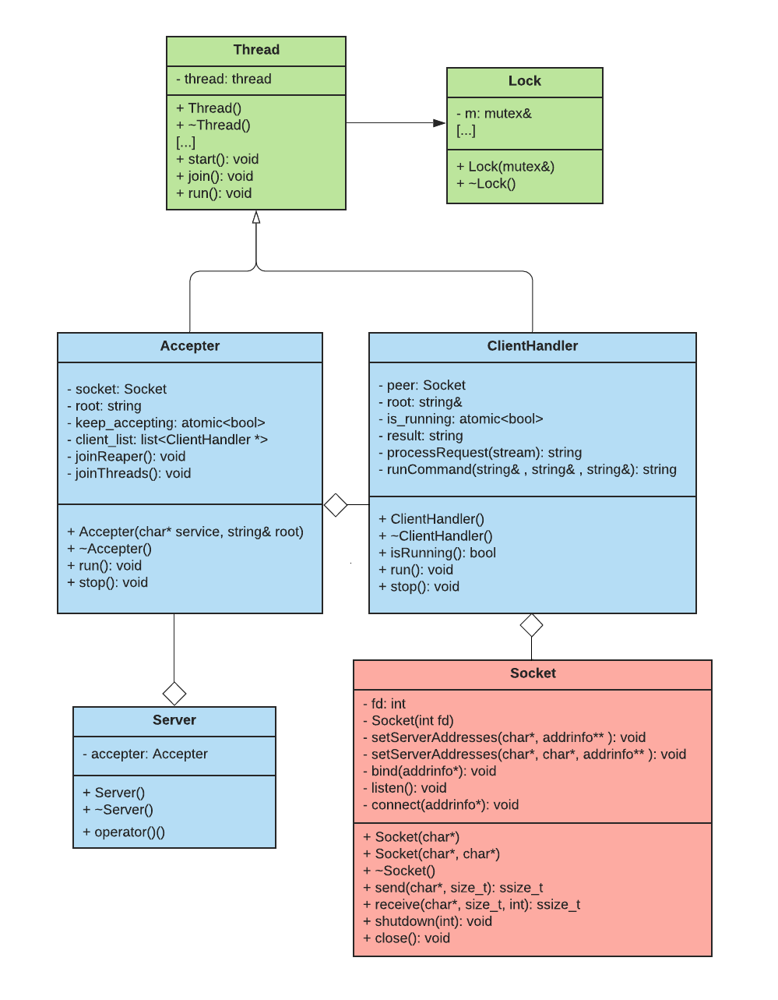
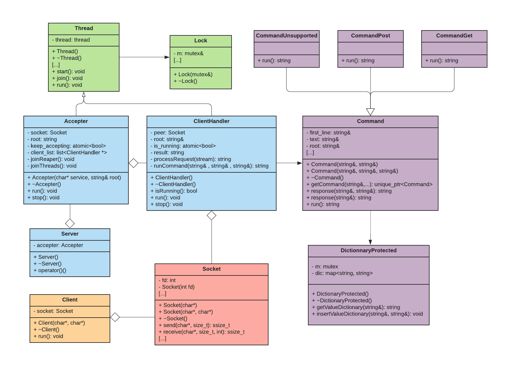

# Taller de Programación I [75.42] - TP3

---

Nombre: BAUNI Chiara

Padron: 102981

Cuatrimestre: 2C 2020

Link al repositorio: [https://github.com/chiabauni/TP3](https://github.com/chiabauni/TP3)

---

# Indice

---

# Presentación del trabajo

## Introducción

Este trabajo practico consiste en desarrollar dos programas: un cliente y un servidor. El programa emisor deberá leer un mensaje por entrada estándar siguiendo el protocolo HTTP, enviárselo al servidor y esperar su respuesta. El servidor deberá poder aceptar varios clientes a la vez, recibir y responder el mensaje de cada uno e imprimir el petitorio por salida estándar.

## Descripción

En este trabajo practico se implementará un programa cliente y un servidor multi-cliente que se comuniquen a través de sockets TCP manejando los petitorios según el formato HTTP.

---

# Especificaciones provistas

## Protocolo HTTP

El protocolo HTTP posee el siguiente formato

- La primer linea contiene la forma: `<metodo> <recurso> <protocolo>` .
- Las siguientes lineas tienen la forma :`<clave>:<valor>`
- Una linea vacía indica el fin de la cabecera.
- El cuerpo (“body”) del petitorio si el método posee uno.

En este caso en particular que vamos a implementar, solo nos vamos a concentrar en los métodos GET y POST que serán los únicos soportados por este programa. Ademas vamos a asumir que los petitorios siempre respetan el protocolo.
Para simplificar el procesamiento, en el protocolo se cambiaron los saltos de linea “\r\n” por “\n”. Las siguientes son las respuestas a implementar para los distintos métodos.

1. GET/ : la respuesta será “HTTP 200 OK\nContent-Type: text/html\n\n” seguido del contenido del `<root_file>` .
2. GET/<recurso> : si el recurso existe la respuesta será “HTTP 200 OK\n\n” seguido del contenido del <recurso>, si el recurso no existe la respuesta será “HTTP 404 NOT FOUND\n\n”.
3. POST/ : la respuesta será “HTTP 403 FORBIDDEN\n\n”.
4. POST/<recurso> : se creará el recurso correspondiente a la ruta, y su contenido será el "body" del mensaje.
5. Otro método : la respuesta será “HTTP 405 METHOD NOT ALLOWED\n\n”: 

## Restricciones

La siguiente es una lista de restricciones técnicas exigidas:

- El sistema debe desarrollarse en ISO C++11.
- Está prohibido el uso de variables globales.
- Se deberá aplicar polimorfismo en la resolución de respuestas del servidor.
- Se deberá sobrecargar el operador () en alguna clase.
- Se debe realizar una limpieza de clientes finalizados cada vez que se conecta uno nuevo.
- No se debe usar sockets no bloqueantes ni leer de a 1 carácter.

## Formato de Línea de Comandos

Servidor: `./server <puerto/servicio> <root_file>` donde `<root_file>` es el puerto TCP del cual el servidor deberá escuchar las conexiones entrantes.

Cliente: `./cliente <ip/hostname> <puerto/servicio>` donde `<ip/hostname>` es la dirección ip de la maquina donde el servidor esta corriendo al cual el cliente se conectará 

Ademas recibirá por entrada standard el texto correspondiente a un petitorio HTTP, el cuál leerá y enviará por socket hasta llegar a EOF.

## Entrada/Salida

El servidor devolverá 0 si su ejecución fue exitosa. Si la cantidad de parámetros es incorrecta, se cancela la
ejecución y se devuelve 1. El cliente deberá devolver siempre 0.

El servidor esperará el caracter ‘q’ por entrada estándar. Cuando lo reciba, el servidor deberá cerrar el
socket aceptador, y esperar a que las conexiones se cierren antes de liberar los recursos y retornar. Tambien impreme por salida estandar la primera linea del petitorio si se trata de un metodo permitido.

El cliente recibirá por entrada estándar el petitorio para enviar al servidor y por salida estándar se imprimirá la respuesta del servidor.

---

# Modelo propuesto

## Implementación

A la hora de la resolución del trabajo planteado, primero comencé a diseñar el server multi-cliente, para poder primero crear un server que vaya aceptando clientes de manera concurrente. Por lo que al comienzo no le di mucha importancia al formato de los mensajes a enviar. Con este primer objetivo en mente cree las siguientes clases:

- **Server**: al comenzar con la ejecucción del programa el server_main, el hilo principal, es quien instancia al Server. El Server se encarga de manejar el flujo del programa servidor, y se compone de un Accepter el cual se encuntra en un hilo aparate. Mientras tanto el hilo del Server (luego de lanzar correctamente el hilo del Accepter) queda a la espera del caracter 'q'. Al encontrarse con el caracter 'q' se cierra todo correctamente y se finaliza la ejecución.
- **Accepter**: el Accepter acepta las conexiones entrantes y se compone de una lista con los distintos clientes aceptados. Mientras la variable keep_accepting sea verdadera seguira esperando nuevas conexiones y cada vez que reciba una conexión nueva, se instanciará un hilo nuevo para cada cliente(se instancia un nuevo objeto Client Handler), y este hilo se agregará a la lista.
- **Client Handler**: los multiples hilos de Clients Handlers  son los encargados de recibir los comandos enviados por el cliente, procesarlos y devolver una respuesta.
- **Thread**: para lograr encapsulamiento y mayor legibilidad, generamos la clase Thread que se encarga de lanzar el método run() en un hilo, y de proporcionar la interfaz necesaria para la interacción con el hilo (poder hacer start al un hilo, o poder hacerle join).
- **Lock**:  para lograr encapsulamiento y mayor legibilidad, generamos la clase Lock, que se encarga de bloquear o desbloquear según corresponda un mutex.
- **Socket**: esta clase nos permite encapsular los métodos necesarios para permitir la conexión Cliente-Servidor. Principalmente, el socket se conforma por un file descriptor que lo identifica.

Una vez que esta primera parte funciono correctamente, comencé con la implementación del protocolo HTTP. Para esto fue necesario crear las siguientes clases:

- **Client**: esta clase se instancia cuando se ejecuta el programa cliente, y es el encargado de manejar el flujo de ese programa. Esta clase tiene un socket propio, con el que se conectaría al servidor. Ademas envia una mensaje al servidor y recibe su respuesta.
- **Command**: esta es una clase abstracta que se encarga de procesar los mensaje recibidos y enviar la respuesta correcta.
- **CommandGet**: implementa la clase Command cuando se trata del comando GET.
- **CommandPost**: implementa la clase Command cuando se trata del comando POST.
- **CommandUnsupported**: implementa la clase Command cuando se trata de un comando invalido.
- **DictionaryProtected**: esta clase cuenta con una Critical Section la cual se debe proteger ya que se trata de un recurso compartido por los hilos. Por este motivo el mecanismo utilizado para la protección en este TP son los mutex. En esta clase "monitor" la Critical Section esta compuesta por la función getValueDictionary() que se encarga de, dada una key devolver el valor asignado a la misma; y la función insertValueDictionary() que se encarga de agregar al diccionario una key con su valor.
- **Exception**: clase utilizada a la hora de lanzar una excepción.

## Modelo final

El diseño final consta de 10 clases(sin incluir clase Exception) con responsabilidades claras y un acoplamiento razonable. Los mismos se muestran a continuación:

